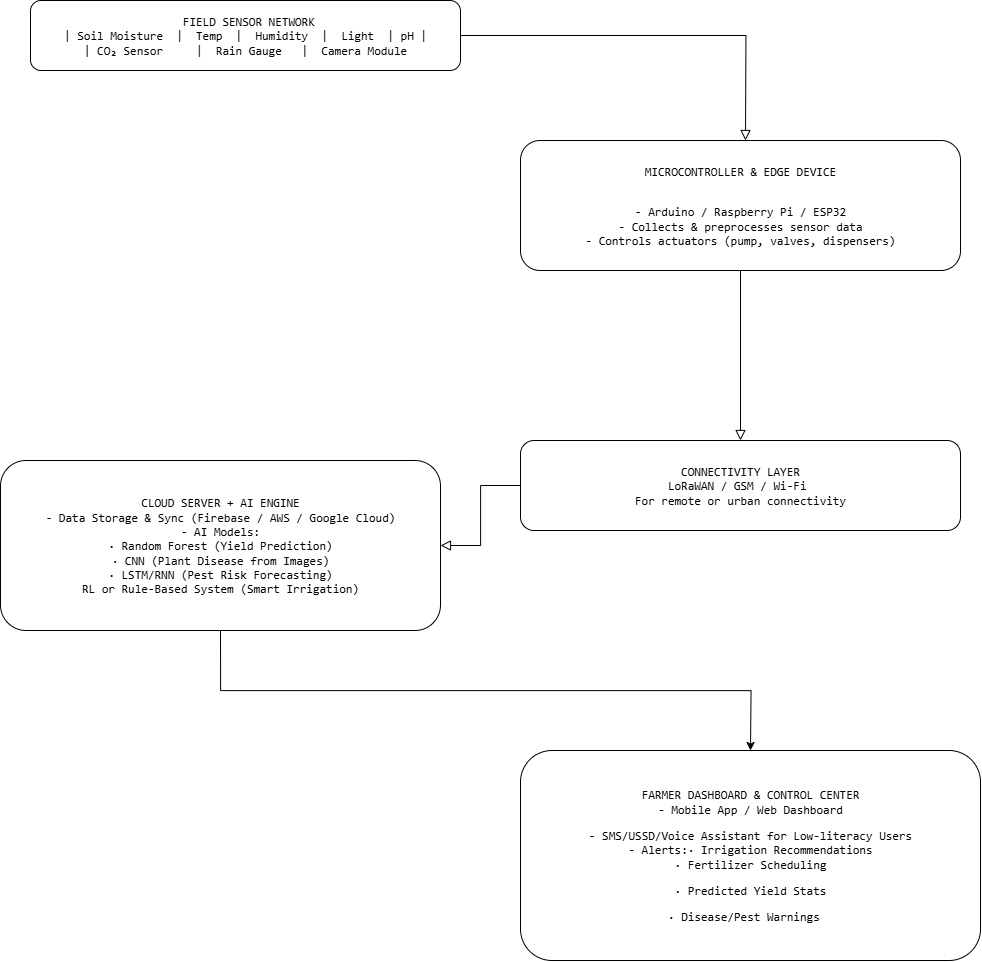

# AI_Future_Directions

# Task 2 AI-Driven IoT Concept

# Smart Agriculture System Proposal (AI + IoT for African Farmers)

This repository contains a concept proposal for a Smart Agriculture System that integrates **Artificial Intelligence (AI)** and the **Internet of Things (IoT)** to address key challenges faced by African farmers.

## 📌 Overview

The proposal is tailored for smallholder and rural farmers in Africa who face unpredictable weather, limited access to irrigation, and market inconsistencies. By using sensor networks and AI models, this system aims to:

- Monitor environmental and soil conditions in real-time
- Automate irrigation and fertilization
- Predict crop yields and detect diseases early
- Deliver actionable insights through mobile apps, SMS, or USSD

## 🛠 Components

- Soil moisture, temperature, light, and pH sensors
- IoT microcontrollers (ESP32/Arduino)
- LoRaWAN or GSM communication
- AI Models: Random Forest for yield prediction, CNN for disease detection
- Farmer dashboard (mobile/web interface or SMS)

## 📥 Download the Full Proposal

👉 [Click here to download the concept proposal (PDF)](./Smart_Agriculture_Concept_Proposal.pdf)

> This document outlines the system architecture, data pipeline, AI models, and tailored features for African agricultural conditions.

## 🤝 Flow Diagram

---
